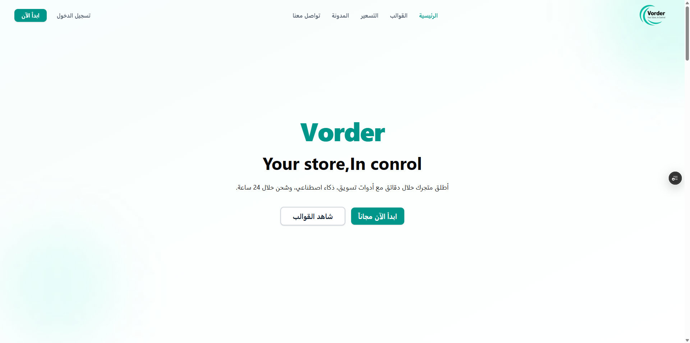
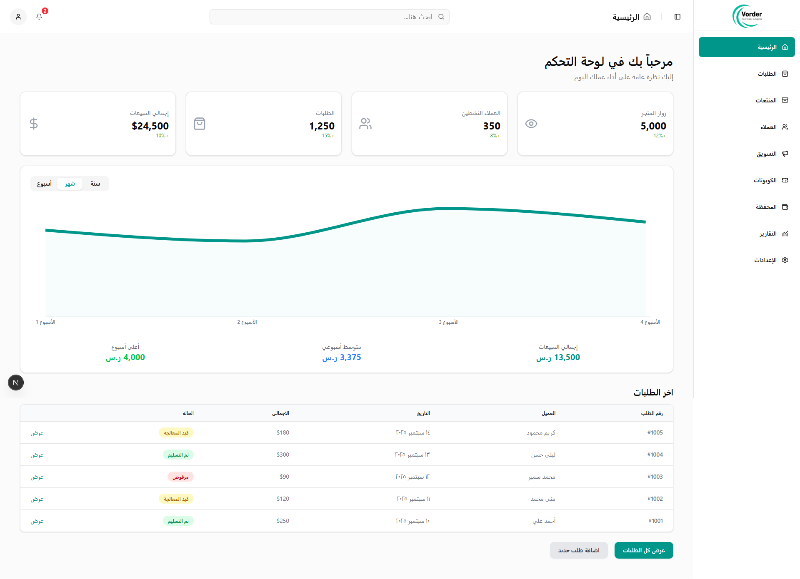
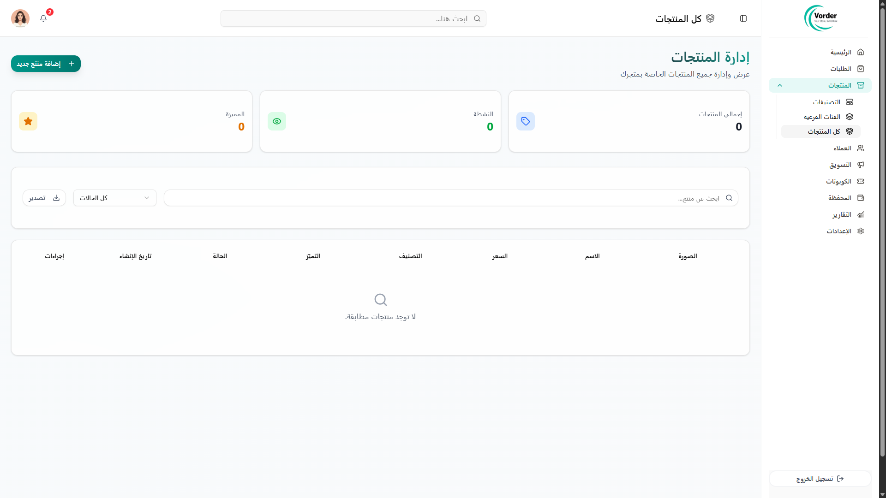
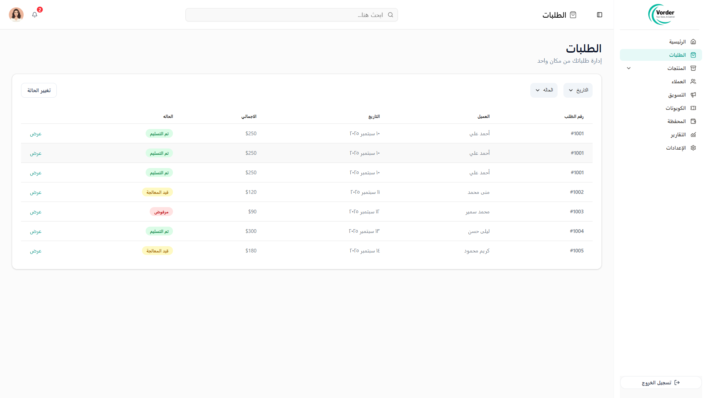
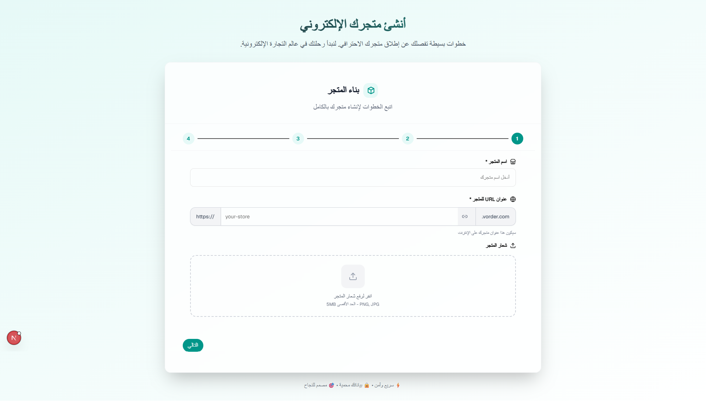
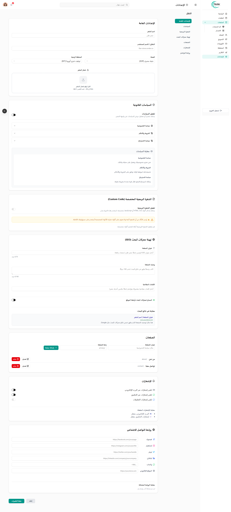
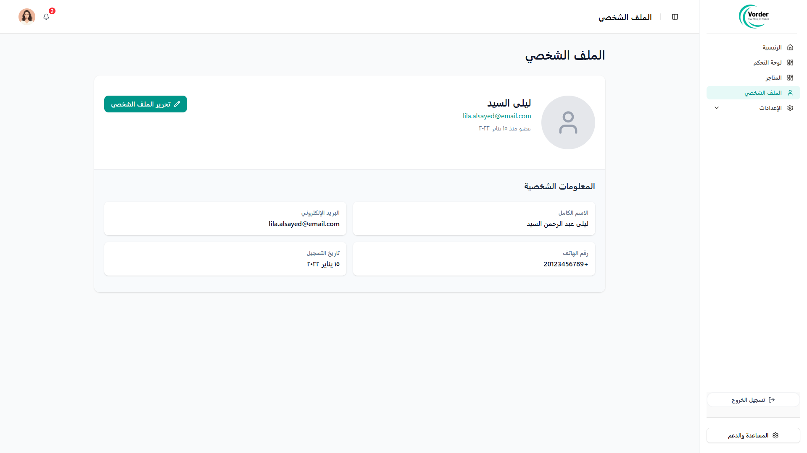
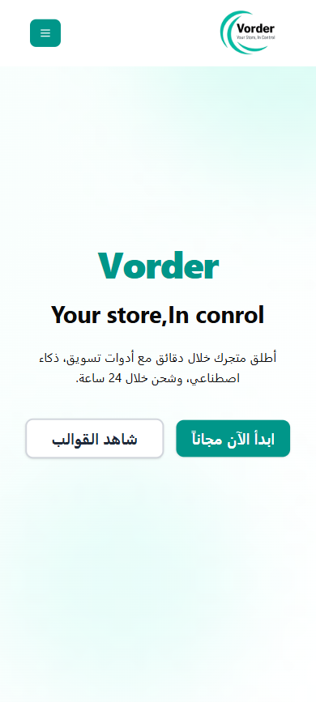

# Vorder

<p align="center">

### Modern Multi-Tenant SaaS E-Commerce Platform

Scalable, merchant-first commerce infrastructure built with modern front-end architecture, designed to power customizable online stores through a unified management platform.

</p>

---

## 🌐 Live Demo

**Live Application:** https://vorder-sigma.vercel.app/

---

# Overview

Vorder is a modern multi-tenant SaaS e-commerce platform inspired by Shopify, designed for scalability, maintainability, and exceptional merchant experience.

The platform allows a single user to manage multiple online stores from one unified dashboard while providing a complete storefront, product management system, order management, marketing tools, analytics, and store customization.

The architecture has been designed with future expansion in mind, including AI automation, payment gateways, subscriptions, custom domains, and third-party integrations.

---

# Project Status

> 🚧 Active Development

The project is currently under continuous development with ongoing architectural improvements before reaching the production stage.

Current focus:

- Multi-Tenancy Improvements
- Products & Orders System
- Storefront Integration
- Production Architecture

---

# My Role

**Lead Front-End Engineer**

As the Lead Front-End Engineer, I owned the complete front-end implementation of Vorder—from UI/UX execution and application architecture to API integration and scalable component development—while collaborating closely with backend engineering throughout the product lifecycle.

My responsibilities included:

- Front-End Architecture
- Dashboard Development
- Marketing Website
- Storefront Development
- Design System
- API Integration
- Authentication Flow
- Responsive UI
- Performance Optimization
- Cross-Team Collaboration

---

**Team:** 1 Front-End Engineer (Self) • 1 Back-End Engineer • 3 Marketing Specialists

---

# Platform Modules

## Marketing Website

- Landing Page
- Pricing
- Features
- Templates
- Blog
- Help Center
- Careers
- Contact
- Legal Pages

---

## Merchant Dashboard

- Dashboard Home
- Products
- Orders
- Customers
- Categories
- Wallet
- Reports
- Marketing
- Themes
- Store Settings

---

## Storefront

- Home
- Categories
- Product Details
- Shopping Cart
- Checkout
- Order Success

---

# Current Features

### Authentication

- Register
- Login
- Google Authentication
- Email Verification
- Forgot Password
- Reset Password

### Dashboard

- KPI Dashboard
- Responsive Layout
- Sidebar Navigation
- Notifications
- Search
- User Menu

### Products

- Product Management
- Variants
- Inventory
- Images
- SEO

### Orders

- Orders List
- Status Timeline
- Tracking
- Customer Details

### Categories

- Categories
- Sub Categories

### Marketing

- Coupons
- Facebook Pixel
- Google Analytics
- Google Tag Manager

### Wallet

- Wallet Dashboard
- Transactions
- Balance Overview

### Reports

- Sales Reports
- Profit Reports
- Best Products

---

# Tech Stack

## Frontend

| Category | Technologies |
|----------|--------------|
| Framework | Next.js, React |
| Language | TypeScript |
| Styling | Tailwind CSS, shadcn/ui |
| Forms | React Hook Form, Zod |
| State | TanStack Query |
| Networking | Axios, REST APIs |
| Internationalization | next-intl |
| Charts | Recharts |
| Animation | Framer Motion |
| Deployment | Vercel |
| Version Control | Git, GitHub |

---

# Front-End Architecture

The project follows a modular, feature-driven architecture focused on scalability and maintainability.

Key architectural concepts include:

- Feature-Based Organization
- Shared Design System
- API Abstraction Layer
- Reusable Components
- Authentication Guards
- Store Context
- Responsive-First Development
- Type-Safe Forms
- Server State Management

---

# Highlights

- Multi-Tenant SaaS Architecture
- Modular Dashboard
- Responsive Merchant Experience
- Reusable Component Library
- Modern UI Design
- API-Driven Architecture
- Type-Safe Development
- Clean Project Structure

---

# Engineering Challenges

Some of the major engineering challenges addressed during development include:

- Designing a scalable SaaS dashboard architecture.
- Building reusable UI components across dozens of pages.
- Coordinating API contracts with backend services.
- Supporting responsive layouts for large enterprise dashboards.
- Planning multi-store architecture for future scalability.
- Creating a maintainable feature-based project structure.

---

# Lessons Learned

Working on Vorder significantly improved my experience in:

- SaaS Product Development
- Large-Scale React Applications
- Front-End Architecture
- Design Systems
- API Integration
- Cross-Team Collaboration
- Performance Optimization
- Enterprise Dashboard Development

---

# Roadmap

### Core Platform

- Multi-Tenant Improvements
- Products CRUD
- Orders System
- Customers Module

### Commerce

- Payment Integration
- Wallet Logic
- Shipping
- Coupons

### Marketing

- Pixels
- Analytics
- Reports

### Infrastructure

- Cloud Storage
- Custom Domains
- SSL Provisioning
- Monitoring

### Future Vision

- AI Product Generator
- AI Store Builder
- AI Marketing Agent
- AI Customer Support

---

# Repository Structure

```
src/
├── app/
├── components/
├── features/
├── hooks/
├── layouts/
├── lib/
├── providers/
├── services/
├── styles/
├── types/
└── utils/
```

---

## Screenshots

| Cover | Dashboard |
|-----------|----------|
|  |  |

| Products | Orders |
|--------|-----------|
|  |  |

| Analytics | Settings |
|-----------|----------|
|  |  |

|  profile | Mobile | 
|--------|-----------|
|  |  |

---

# Documentation

Additional engineering documentation is available inside the `/docs` directory.

- Architecture
- Features
- Responsibilities
- Challenges
- Roadmap

---
## License

This repository is shared for portfolio and demonstration purposes only.

The production source code remains private and proprietary.

---

# Disclaimer

This repository is intended to showcase the engineering work completed on the Vorder platform.

The original production source code is proprietary and cannot be published due to ownership and confidentiality agreements.

This repository contains documentation, architecture, and selected implementation details for portfolio and educational purposes only.
